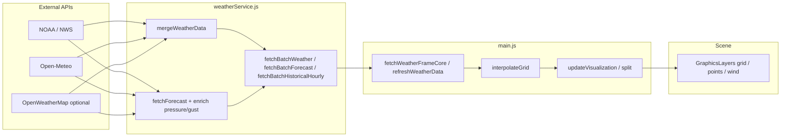

# Architecture overview

High-level map of how **Coral Gables Weather Grid** is structured: data flow, major modules, and view modes. For API providers and trust notes, see **`API.md`**.

## Runtime model

- **Single-page app** — `index.html` loads ArcGIS JS API from CDN, then `/js/main.js` (Vite-bundled in production).
- **No backend** in the default design — weather and alerts are fetched with **`fetch`** from the **user’s browser** to public APIs.
- **IndexedDB** (`js/storage/db.js`) stores **snapshots** on each successful refresh (pruned by the same retention window as playback) for **fallback** historical playback if Open-Meteo hourly backfill is unavailable.

## Data flow (refresh → map)

**Forecast enrichment:** When the longest forecast timeline (often NWS) omits **pressure** or **wind gust**, values are copied from Open‑Meteo or OpenWeatherMap by **closest timestamp** (`enrichForecastPressureFromSources`, `enrichForecastWindGustFromSources`).

**Grid:** Station values are **inverse-distance weighted** (`js/utils/interpolation.js`) into each cell — not a mesoscale model.

## Major modules

| Path                                                  | Responsibility                                                                                                                                           |
| ----------------------------------------------------- | -------------------------------------------------------------------------------------------------------------------------------------------------------- |
| `js/main.js`                                          | App state, ArcGIS SceneView init, UI wiring, refresh pipeline, modes (current / forecast / historical / split), `debugLog`, global error handlers        |
| `js/config.js`                                        | Constants: grid extent, API URLs, scene, refresh intervals                                                                                               |
| `js/api/weatherService.js`                            | Merge priorities, batch fetches (`fetchBatchWeather`, `fetchBatchForecast`, `fetchBatchHistoricalHourly`), forecast selection + enrichment               |
| `js/api/noaa.js`, `openmeteo.js`, `openweathermap.js` | Provider-specific `fetch` + parse (`openmeteo.js` includes hourly past window for historical playback)                                                   |
| `js/features/timeFeatures.js`                         | `getForecastData`, `buildSnapshotsFromHistoricalHourly`, `finalizePlaybackSnapshots`, wall-clock slider helpers, `PlaybackController`, IndexedDB helpers |
| `js/storage/db.js`                                    | IndexedDB read/write                                                                                                                                     |
| `js/viz/wind.js`                                      | Wind vectors and area-mean wind graphic                                                                                                                  |
| `js/utils/interpolation.js`                           | IDW and grid interpolation                                                                                                                               |
| `vite.config.js`                                      | Build; dev/preview middleware for **`/__debug_log`**                                                                                                     |

## View modes (where logic splits)

| Mode              | Data source                                                                                                                      | Typical entry in `main.js`                                                        |
| ----------------- | -------------------------------------------------------------------------------------------------------------------------------- | --------------------------------------------------------------------------------- |
| Current           | Merged live `fetchBatchWeather` → `state.samplingPoints` / `gridCells`                                                           | `refreshWeatherData`, `updateVisualization`                                       |
| Forecast 3h / 24h | `state.forecastData` + `TimeFeatures.getForecastData(..., hours)`                                                                | `showForecast`, split helpers                                                     |
| Historical        | Prefer **Open-Meteo hourly** frames in `state.historicalSnapshots` (hydrated in `main.js`); else IndexedDB; `PlaybackController` | `hydrateHistoricalSnapshotsFromApi`, `rebindHistoricalPlaybackController`, slider |
| Split-screen      | Combines two modes via `getSamplingPointsAndGridForSplitMode`                                                                    | `updateSplitVisualization`                                                        |

## Testing

- **Vitest** unit tests live under `tests/` — merge rules, NOAA wind parsing, IDW, time/forecast helpers (`npm run test`).

## Related docs

- **`../README.md`** — Run and project layout
- **`USER_MANUAL.md`** — End-user operations
- **`DEPLOY.md`** — Static deploy
